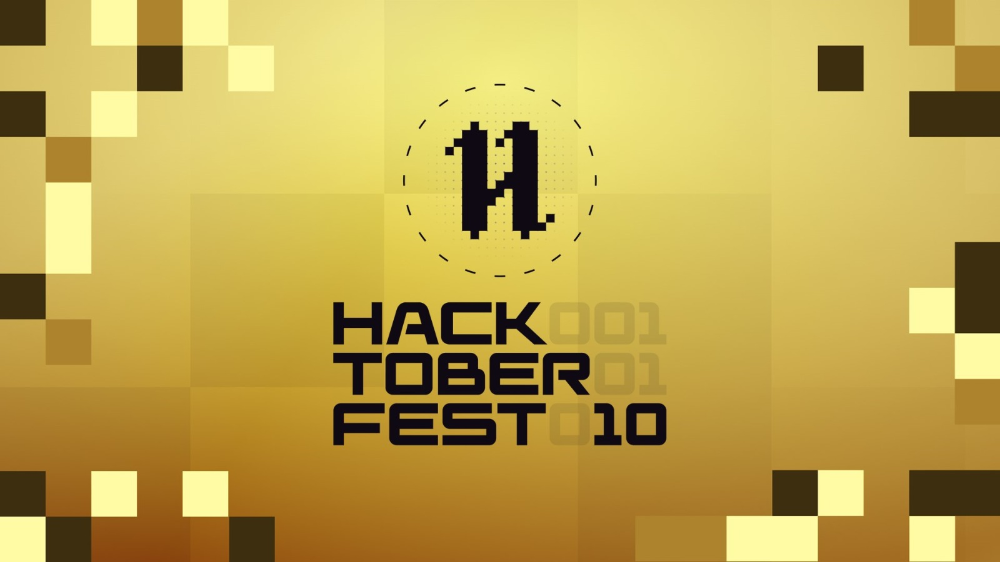

<!-- Hacktoberfest 2023 - GDSC GitHub Landing Page -->

# GDSC I2IT welcomes you to Hacktoberfest 2023 🚀

## About Us

The Google Developer Student Clubs (GDSC) are passionate about open source and excited to welcome you to Hacktoberfest 2023! This is the perfect opportunity for newcomers to learn GitHub and make their first contributions to open-source projects.

## First Contribution Repository

### [👉 First Contribution Repository](link_to_first_contribution_repo)

🌟 *Learn GitHub Basics and Make Your First Contribution!* 🌟

This repository is designed for beginners. It includes step-by-step instructions and sample tasks to help you get started:

1. *Fork* this repository to your own GitHub account.
2. *Clone* the forked repository to your local machine.
3. *Create a new branch* for your changes.
4. *Add your name* to the CONTRIBUTORS.md file.
5. *Commit* your changes and *push* them to your GitHub repository.
6. Create a *Pull Request* to the original repository.

If you're new to GitHub, don't worry! We have detailed tutorials and a friendly community ready to assist you.

## Join the Hacktoberfest Fun!

- Register at [Hacktoberfest](https://hacktoberfest.digitalocean.com/).
- Explore our [First Contribution Repository](link_to_first_contribution_repo).
- Connect with us on [Discord](link_to_discord) for support and collaboration.
- Let's make October awesome by contributing to open source!

